**11.Creating Switching Branches**

**What is Branch?**

Branch is a way to add new features or modification to the software and not affect the main part of the project. We can also say that branches create another line of development in the project.

**how to create and switch to a branch:**

- Open Git Bash on your local repository.
- Let’s create a branch by typing “git checkout -b branchname”.

- Now if you modify the files in the repo and do “git status” it will show you “on Branch branchname” which means you are changing files on the branch you have created.

- Let’s stage these files by using “git add .” and commit these changes by typing “git commit -m “commit message” ”.

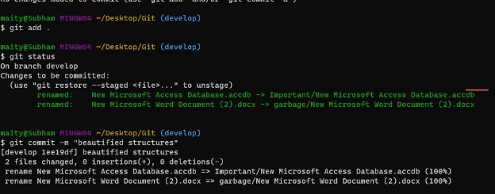

- Now if you do “git checkout master” then you will see that the files on your repo will revert to the master branch where we haven’t made any changes.

Before Switching the master branch

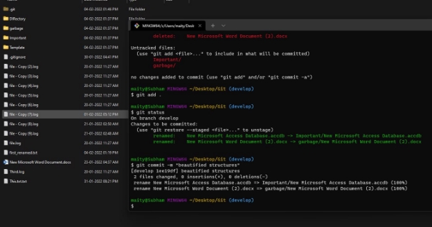

After Switching the master branch

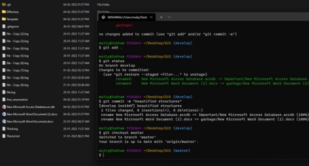

Before After GIF Footage

- Now if we do “git checkout branchname” we will switch from master branch to our newly created branch where we have modified files.

So this is how you create and switch to different branches.

**Revision**

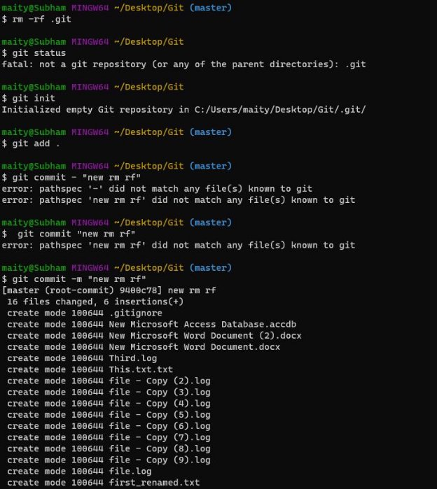

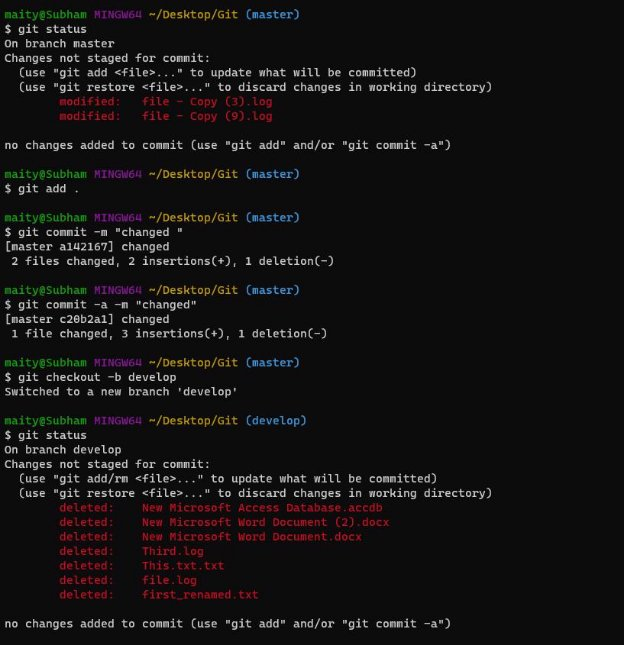

**Switching(Live Example) Video**

**12.Branching & Merging a Production Grade Project**

Today we are going to learn how to merge branches in Git. So let’s get started.

*Note: This is a recap video of everything we have done so far in this series. Also I have explained merging branches in this video. If you want to recap everything and then want to learn git merge, then watch the complete video. And if you just came to learn merging see down below.*

**Let’s see how to merge branches:**

- Open Git Bash on your local repository.
- Let’s create a branch by typing “git checkout -b branchname”.
- Now if you modify the files in the repo and do “git status” it will show you “on Branch branchname” which means you are changing files on the branch you have created.
- Let’s stage these files by using “git add .” and commit these changes by typing “git commit -m “commit message” ”.
- Now if you do “git checkout master” then you will see that the files on your repo will revert to the master branch where we haven’t made any changes.
- Now if we do “git merge branchname” it will merge those branches.
- Now we just need to stage and commit those changes by typing “git add .” & “git commit -m “commit message” ”.

**13.Resolving Merge Conflicts**

**When Merge Conflicts happen?**

When you merge branches that have competing commits, and Git cannot decide which changes to incorporate in the final merge, that's when merge conflicts happen.

**Resolving Conflicts:**

There are many ways to resolve conflicts on Git Merge. But we are going to use the easiest one. By using VSCode. Just Install VS Code in your system and open those files who have conflicts, and you will see 2 options: Current Change and Incoming change. Just like this.

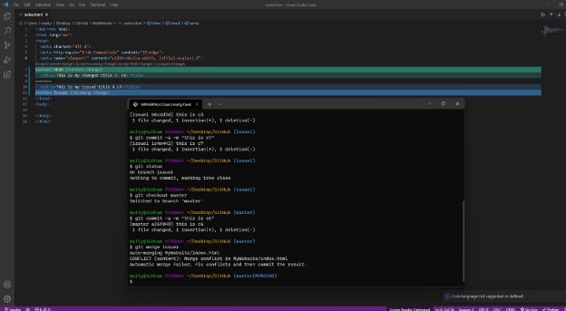

Just choose Accept Incoming change. Save the file and commit the files by typing “git add .”, and “git commit -m “message” ”. Now you have successfully merged 2 branches.

**Branch Management:**

We can create many branches in our repository and work in them. We also need to manage them. So let’s see few commands for managing branches in Git:

- To see all the branches you have created you will need to use this command : “git branch” and the current branch will have “\*” in front of the branch.
- To see Branches and that branch’s last commit along with it’s message type “git branch -v” and press enter.
- If you want to see which branches were merged then use “git branch --merged” and those that were not merged use “git branch --no-merged”.
- To delete a branch we need to use “git branch -d branchname”. Note that this command will fail if the branch we are deleting has not merged to the main branch. To tackle this error we will use “git branch -D branchname”, it will delete the branch even if it's not even merged yet.

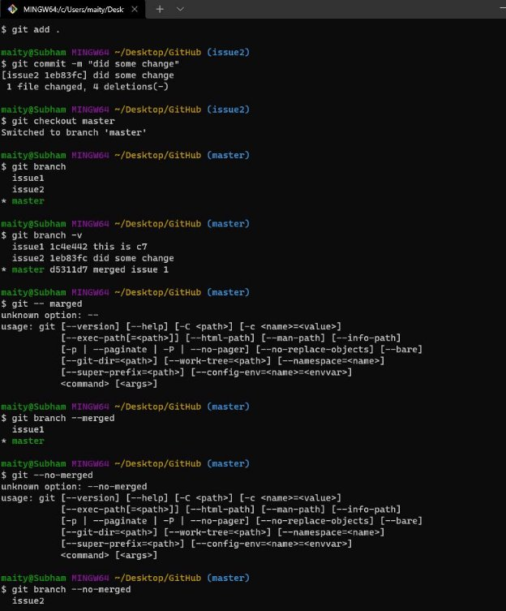

**14.Git Branching Workflow in Production**

When people usually use git they create branches and primarily they create 2 types of branches. **Long Running Branches:**

A long-running branch is a branch under active development that is not merged to the main branch for a long time. The main branch might be, for example, master or develop.

**Topic Branches:**

Topic branch is a short lived branch which was created for a single particular feature or related work. Topic branches can be deleted after the particular feature is added to the project. **Example:**

Let’s assume you were working on a project where you have committed C1 on the master branch and then an issue has arised and to solve that issue you have created a new branch

called issue and you have committed C2 and you came back to master to complete the work and committed C3 on master and went to the issue branch and committed C4, C5 and C6. When you were on C4 you came across another new issue and to fix that you have again created another new branch called Issue1 V2 and committed C7, C8 and C11 where you have solved that issue. After that you came to the Master branch and committed to C9, C10 and you got an idea. To implement the idea you created another branch named IDEA and committed C12 and C13. Now you want to Merge IDEA on to Master. Also you want to commit Issue1 V2 too. Now you have merged C11 of Issue1 V2 branch and C13 of IDEA branch and created a commit named C14 which is your master branch.

**15.Git Branching Workflow in Production**

When people usually use git they create branches and primarily they create 2 types of branches. **Long Running Branches:**

A long-running branch is a branch under active development that is not merged to the main branch for a long time. The main branch might be, for example, master or develop.

**Topic Branches:**

Topic branch is a short lived branch which was created for a single particular feature or related work. Topic branches can be deleted after the particular feature is added to the project. **Example:**

Let’s assume you were working on a project where you have committed C1 on the master branch and then an issue has arised and to solve that issue you have created a new branch

called issue and you have committed C2 and you came back to master to complete the work and committed C3 on master and went to the issue branch and committed C4, C5 and C6. When you were on C4 you came across another new issue and to fix that you have again created another new branch called Issue1 V2 and committed C7, C8 and C11 where you have solved that issue. After that you came to the Master branch and committed to C9, C10 and you got an idea. To implement the idea you created another branch named IDEA and committed C12 and C13. Now you want to Merge IDEA on to Master. Also you want to commit Issue1 V2 too. Now you have merged C11 of Issue1 V2 branch and C13 of IDEA branch and created a commit named C14 which is your master branch.

**16.Pushing Git Branches To Remote Repositories | Git Tutorials**

So let’s open git bash and run “git status” so see if you have any files to track and “git log” to see what you did on your last commits. Also check the branches you have in your repo by typing “git branch ”. Now let’s go to github.com and login using our username and password. After that click on New repository, and Give a name and description to your repository and press Create repository. Now look for the “Push an existing repository from the command line” tab and copy the first command which looks like this: “git remote add origin git@github.com:username/reponame.git”. Now come to the git bash and paste this command. Now if you do “git remote -v” it will show you that Origin has been added. Now Let’s push our code by typing “git push -u origin main”. Make sure that you have staged and committed your files. When you press enter after the command it will open the github login page, and you just need to login using your same github account and press login.

Now we will push our other branches to github. First let’s switch the branch by typing “git checkout branchname”. And if we now type “git push origin branchname” and press enter, it will push that branch to github and we can check that on github.

We can also merge our branches to the main branch and push the changes. We need to switch

to the main branch first by typing “git checkout main” Now we will merge the branch by typing “git merge branchname” and merge it. Now we will delete the unnecessary branch by typing “git branch -d branchname”. Now if we do “git status” it will show us only the main branch. And now we will push the changes by typing “git push -u origin main”. Now also remove the branch from remote repository too by typing “git push -d origin branchname”. And now if you check on github you will see that the branch has been deleted.

**Adding Two Android Project in my repo and making a branch also faced some issues how i solved this in git bash complete code is here**

[**Full Image Link**](https://drive.google.com/file/d/1CtJtHa2scd5s3cLAkFZ-h03mpOrJ11Ef/view?usp=sharing)

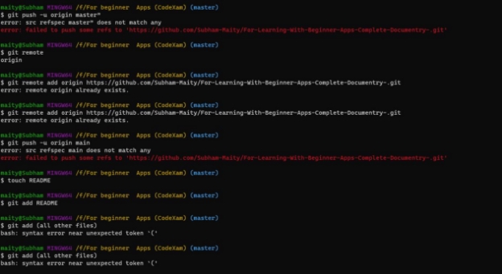

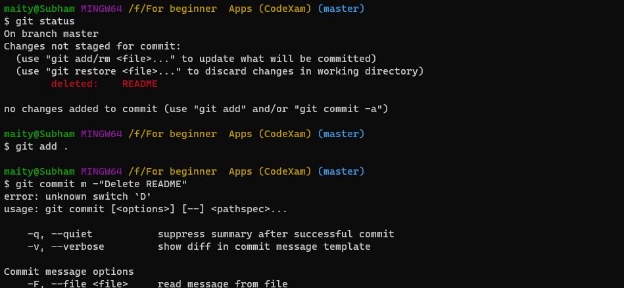

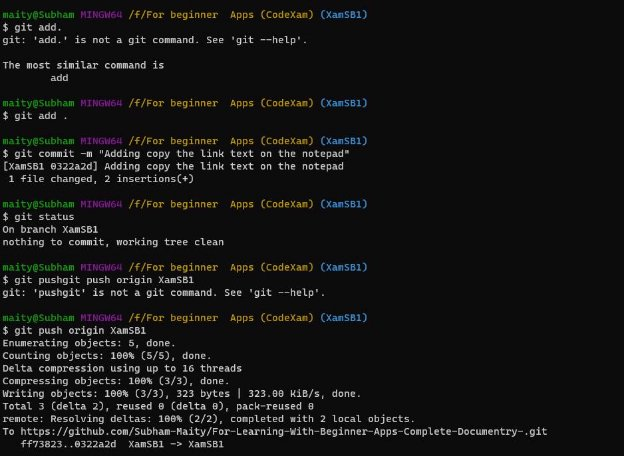

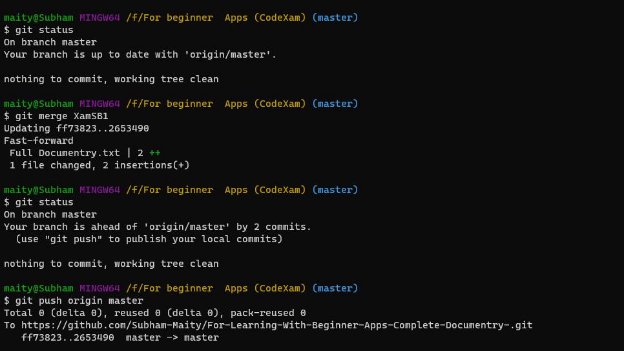

**17.Extra Experience for Master of Git and Terminal**

If you wanna delete any log what should you do ? Let’s make some log first
